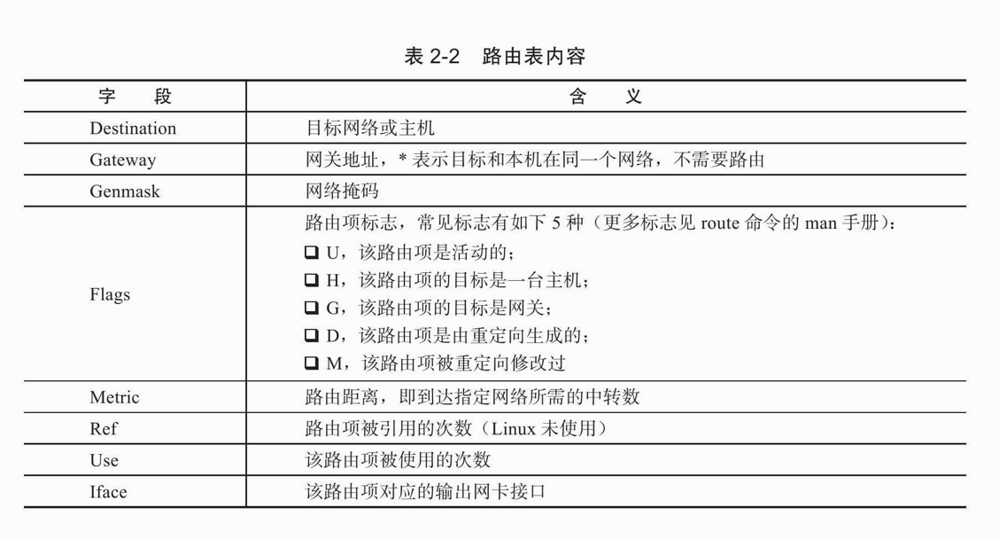
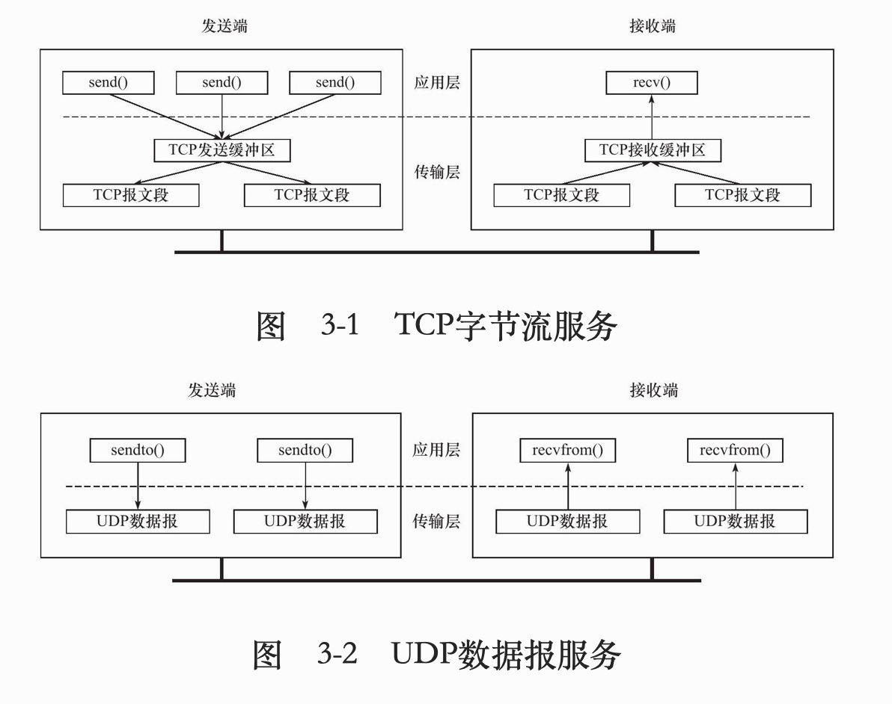
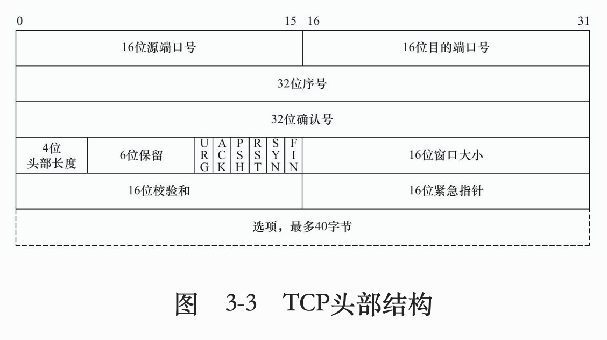
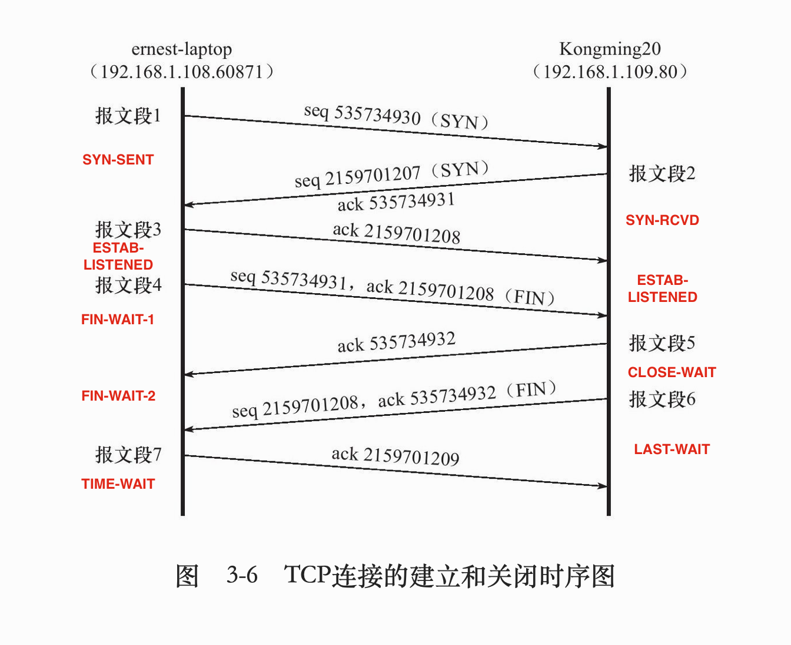
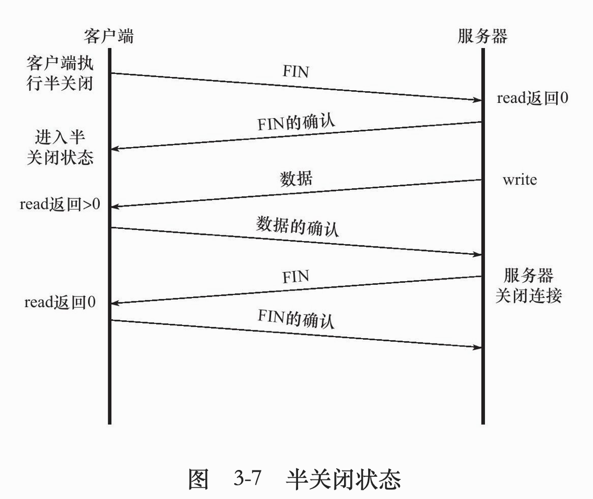
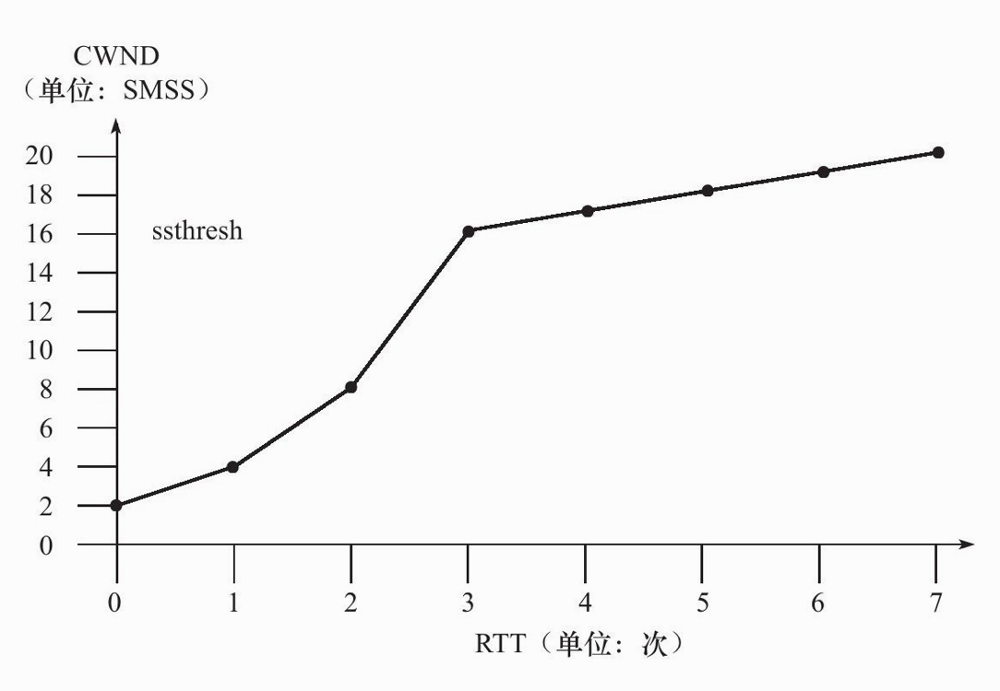
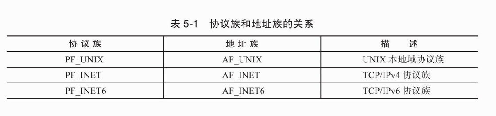

# 《Linux高性能服务器编程》笔记


## 第一章 TCP/IP协议族


* ### TCP/IP协议族主要结构和主要协议
  
  * TCP, IP在后序章节讨论, 本章介绍: ICMP, ARP, DNS协议
  	
  
* 数据链路层:ARP, RARP协议, 实现IP地址与物理地址的转换(通常为mac地址), 以太网, 802.11无线网络, 令牌环都是用mac地址
  
* 网络层:IP, ICMP协议, 实现数据包的选路和转发(主机与主机)
  
* 传输层: TCP, UDP协议, 
  
* 应用层:ping(应用,不是协议), telnet协议(远程登录协议), DNS(Domain Name Server, 域名服务)
  
  可以在/etc/services查看应用层协议, 以及它们使用了哪些传输层服务(tcp/udp)
  
  - 封装:应用程序发送send->TCP/UDP->IP->ARP
  
  - 分用:IP, ARP, RARP协议都是用帧传输协议,需要帧头部区分它们;同样TCP, UDP, ICMP都是用IP协议
  
  
	
- 测试网络
	
	  
	
	- ARP: `arp`可查询ip与mac的映射
	- DNS: IP与域名的映射, 访问DNS的客户端程序`host github.com`(查询github.com域名的ip地址)


## 第二章 IP协议

### 本章重点: 

1. IP头部信息;

2. IP数据报的路由和转发


- IP服务特点: 无状态; 无连接; 不可靠
  - 无状态: 所有数据报相互独立, 没有先后顺序, 所以无法处理乱序和重复IP数据报
  - 无连接: 上层协议每次发送数据都要指明IP地址, 因为没有连接
  - 不可靠: 只尽最大努力, 但比如数据报存活时间过长或校验不正确, 则返回一个ICMP给上层协议报告错误, 自己不会重传, 需要上层自己实现数据确认, 超时重传等可靠传输机制

- ### IPv4头部

  

  IPv4头部通常都是**20字节**

  第一行: **4位** 版本号: 4(IPv4) + **4位** 长度(单位4字节, 4位最大15, 最长头部60字节) +  **8位** TOS服务类型 + **16位**总长度(单位直接,16位 最大65535字节, 但比如以太网帧MTU最大1500(分片));

  第二行(如何实现分片):**16位** 标识(初始随机生成, 每发一个数据报+1,同一数据报所有分片拥有相同标识) + **3位** 标志(一位保留; 一个“禁止分片”位(超MTU会被丢弃); 一个“更多分片”位, 除最后一个分片其他都要置1) +**13位** 偏移 (单位8字节, 所以分片都是8字节的倍数)

  第三行: **8位** 生存时间TTL(通常64) + **8位** 上层协议(ICMP(1), TCP(6),UDP(17)) + **16位** 检验和(CRC算法,仅头部) 

  第四、五行: IP地址

  可选部分: 如记录路由, 时间戳 等

- ### IP路由

  - IP模块工作流程

    

  - 路由表: 使用``route`命令可查看路由表

    


## 第三章 TCP协议

### 本章重点:

1. TCP头部信息; 

2. TCP状态转移(三次握手, 四次挥手); 

3. TCP数据流(交互数据流, 成块数据流); 

4. TCP流量控制(拥塞控制, 超时重传)




TCP, UDP这种区别对应到编程中体现为通信双方是否执行相同次数的读、写操作


- ### TCP头部信息:

  

前20字节固定(一行4字节 4行)

第一行: **16位** 端口 * 2 

第二行: **32位** 序号 当前TCP segment第一个字节的在整个字节流的偏移量, 就是握手挥手时的seq的值

第三行: **32位** 确认号 收到的上一个对方的segment序号+1 就是ack值

第四行: **4位** 头部长度(单位也是4字节, 和IP头部长度一样, 最长都是60) + **6位** 保留 + **6位** 标志位(URG紧急指针, ACK, PSH立即从接收缓冲区读走, RST重连, SYN建立连接, FIN断开申请) + **16位** 窗口大小(告诉发送方窗口剩余)

第五行: **16位** 校验和(包括头部和数据, 区别于IP校验只有头部) + **16位** 紧急指针


- ### TCP状态转移

  

  半双工(半关闭状态): 单方面不再发送, 但还可以接收(其实就是CLOSE-WAIT状态做的事)

  


- ### TCP的可靠传输实现(差错控制机制)

  - 超时重传: 每次增加一倍(1s, 2s, 4s, 8s, 16s, 连续比如5次之后放弃重传并通知应用)

    - 缺陷:信道利用率低
  - 改进一: 连续ARQ协议(利用滑动窗口实现) ,接收方用“累积确认”的方式, 只对正确接收的最后一个分组确认
    - 累积确认注意不能让发送方等待太长,一般<0.5s
    - 缺陷: 无法通知未确认已接收的具体情况, 导致了“回退N帧”的浪费(漏了一个, 后面的收到了,但要全部重传)
  - 改进二: 选择确认(SACK) (成块传输): 通过指明边界(可选部分最长40字节, 1字节SACK=1, 1字节指明SACK长度, 一个指针4字节, 一对8字节, 所以最多可以指明4个字节块)


- ### TCP的流量控制 (不等同“拥塞控制”)

  - 通过控制窗口大小(rwnd, receive window)
    - 隐患一: B发送rwnd = 0给A, 之后B有空间了发送了非零窗口, 但传输过程丢失了, A一直在等非零, B又等A, 造成死锁
      - 解决: 发送rwnd = 0之后, 接收方启动计时, 到时间发送一个“零窗口”探测报文段
  	- 隐患二: 接收方空间满, 应用一次处理1字节或很少, 每次窗口设为1字节, 传1字节,效率极低
  	  - 解决: 接收方等待一段时间/接收缓存有一半以上空间再更新窗口


- ### TCP拥塞控制(与“流量控制”侧重点不同,拥塞控制关注整个网络)

  - 慢开始: 刚开始注入从小到大慢慢加 (翻倍)

  - 拥塞避免: 线性增加窗口大小, 比“慢开始”慢很多

    

  - 快重传: 收到M2立即确认, 收不到M3, 收到M4,M5都对M2确认, 三次发送方就知道M3丢了

  - 快恢复: 发现拥塞不直接用“慢开始”, 而是将窗口/2, 有的是 门限+3*SMSS


## 第五章 Linux网络编程基础API

### 本章重点

1. socket地址API (IP:port)
2. socket基础API `<sys/socket.h` 创建/命名/监听socket, 发起连接, 接收连接, 读写数据, 获取地址等
3. 网络信息API `<netdb.h>` 主机名和ip地址的转换, 服务名与端口号的转换


### socket地址API

- 主机字节序 和 网络字节序

  小端字节序(整数高位存储在内存高位) (主机字节序);大端字节序(网络字节序)

  unix专用socket地址结构体`<sys/un.h>`

  

  ```c++
  #include <sys/un.h>
  struct sockaddr_un{
    sa_family_t sin_family;//地址族
    char sun_path[108];
  };
  
  //另外TCP/IP协议有两个IPv4和IPv6专用结构题, 网络字节序
  struct socketaddr_in{
    sa_family_t sin_family; //AF_INET
    u_int6_t sin_port;//端口号
    struct in_add sin_addr //IPv4结构体
  };
  struct socketaddt_in6{...};
  struct in_addr;//IPv4地址
  struct in6_addr;//IPv6地址
  ```

- IP地址转换函数`<arpa/inet.h>`

  ```c++
  #include <arpa/inet.h>
  int_add_t inet_addr(const char* strptr);//十进制字符串的IPv4地址 -> 网络字节序整数 IPv4地址,失败返回INADDR_NONE;
  int inet_aton(const char* cp,struct in_addr* inp);//跟上面函数功能一样,但将转换后的结果存储在inp指向的地址结构中
  char* inet_ntoa(struct in_addr in);//与第一个函数反过程
  ```

  

  


