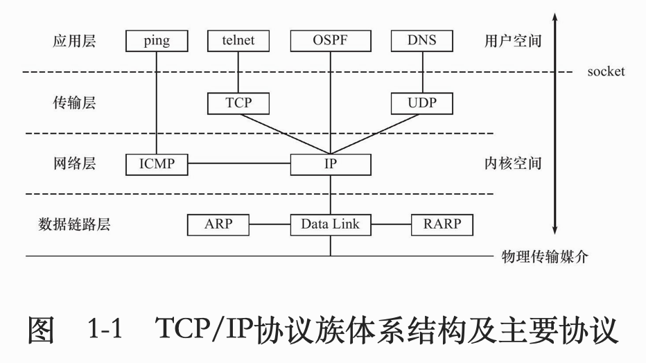
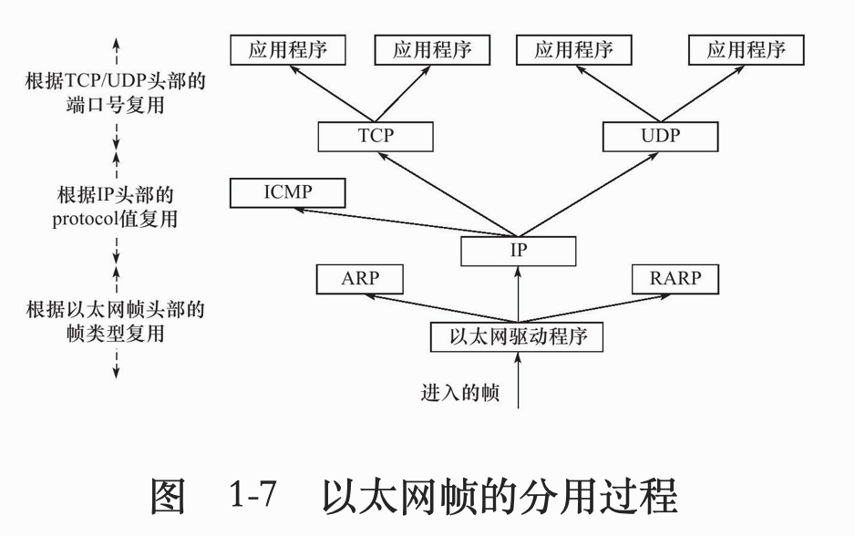
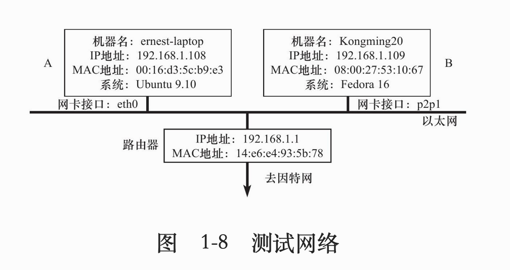
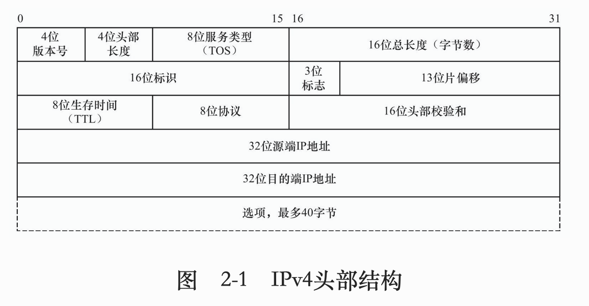
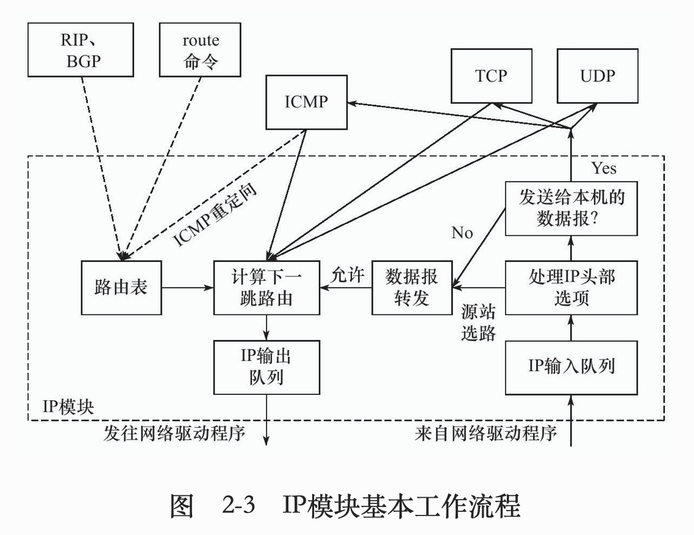

# 《Linux高性能服务器编程》笔记

## 第一章 TCP/IP协议族

* TCP/IP协议族主要结构和主要协议
  * TCP, IP在后序章节讨论, 本章介绍: ICMP, ARP, DNS协议
  	
  	
  * 数据链路层:ARP, RARP协议, 实现IP地址与物理地址的转换(通常为mac地址), 以太网, 802.11无线网络, 令牌环都是用mac地址

  * 网络层:IP, ICMP协议, 实现数据包的选路和转发(主机与主机)

  * 传输层: TCP, UDP协议, 

  * 应用层:ping(应用,不是协议), telnet协议(远程登录协议), DNS(Domain Name Server, 域名服务)

    可以在/etc/services查看应用层协议, 以及它们使用了哪些传输层服务(tcp/udp)

  - 封装:应用程序发送send->TCP/UDP->IP->ARP
  
  - 分用:IP, ARP, RARP协议都是用帧传输协议,需要帧头部区分它们;同样TCP, UDP, ICMP都是用IP协议
  
    

	- 测试网络

	  
	
	- ARP: `arp`可查询ip与mac的映射
	- DNS: IP与域名的映射, 访问DNS的客户端程序`host github.com`(查询github.com域名的ip地址)

## 第二章 IP协议详解

本章重点: IP头部信息; IP数据报的路由和转发

- IP服务特点: 无状态; 无连接; 不可靠
  - 无状态: 所有数据报相互独立, 没有先后顺序, 所以无法处理乱序和重复IP数据报
  - 无连接: 上层协议每次发送数据都要指明IP地址, 因为没有连接
  - 不可靠: 只尽最大努力, 但比如数据报存活时间过长或校验不正确, 则返回一个ICMP给上层协议报告错误, 自己不会重传, 需要上层自己实现数据确认, 超时重传等可靠传输机制

- IPv4头部

  

  IPv4头部通常都是**20字节**

  第一行: **4位** 版本号: 4(IPv4) + **4位** 长度(单位4字节, 4位最大15, 最长头部60字节) +  **8位** TOS服务类型 + **16位**总长度(单位直接,16位 最大65535字节, 但比如以太网帧MTU最大1500(分片));

  第二行(如何实现分片):**16位** 标识(初始随机生成, 每发一个数据报+1,同一数据报所有分片拥有相同标识) + **3位** 标志(一位保留; 一个“禁止分片”位(超MTU会被丢弃); 一个“更多分片”位, 除最后一个分片其他都要置1) +**13位** 偏移 (单位8字节, 所以分片都是8字节的倍数)

  第三行: **8位** 生存时间TTL(通常64) + **8位** 上层协议(ICMP(1), TCP(6),UDP(17)) + **16位** 检验和(CRC算法,仅头部) 

  第四、五行: IP地址

  可选部分: 如记录路由, 时间戳 等

- IP路由

  - IP模块工作流程

    

