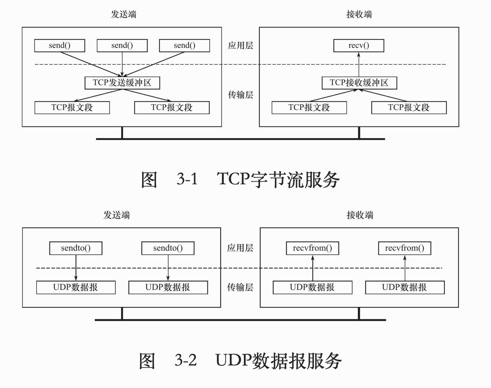
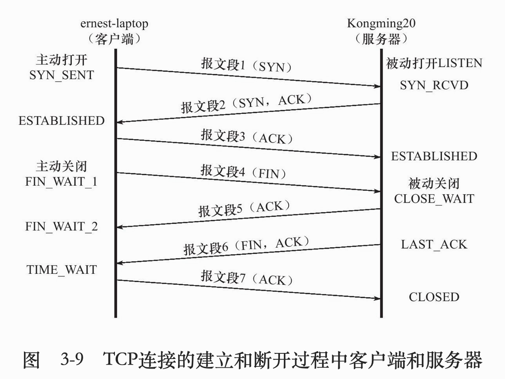
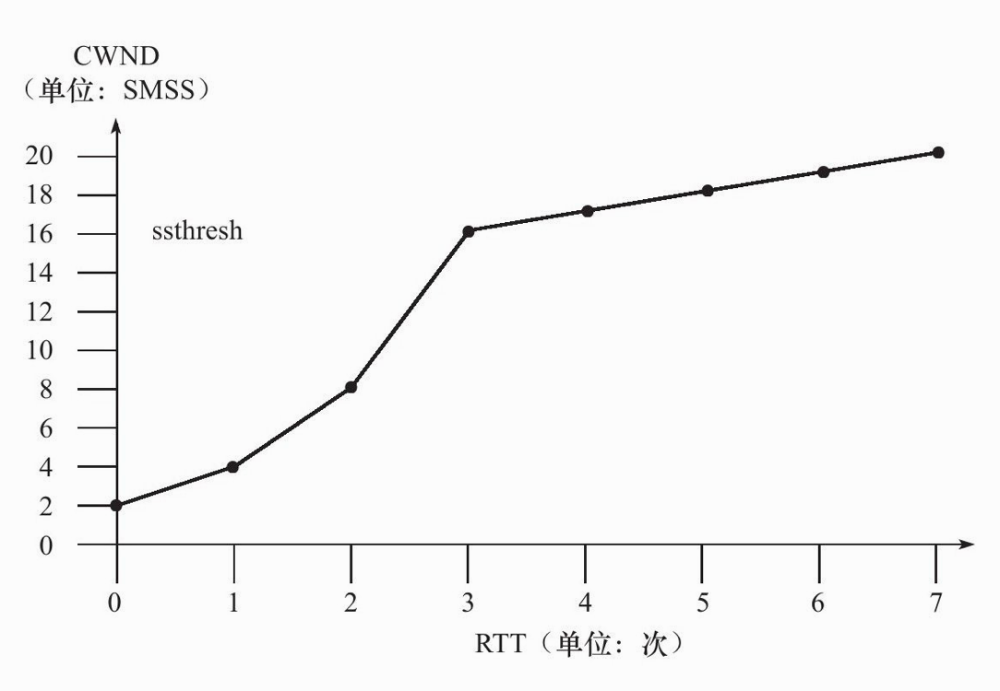
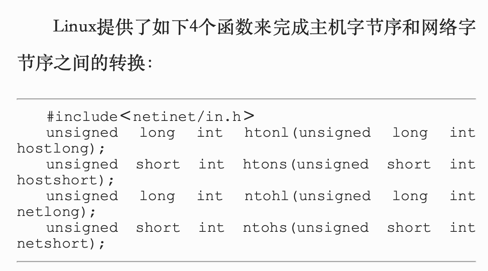
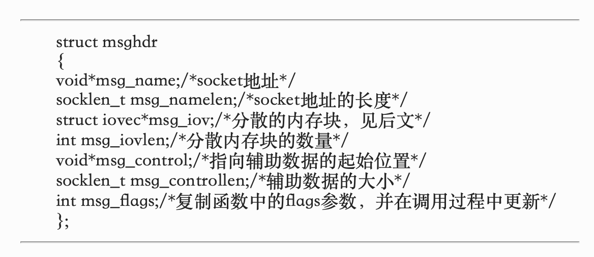
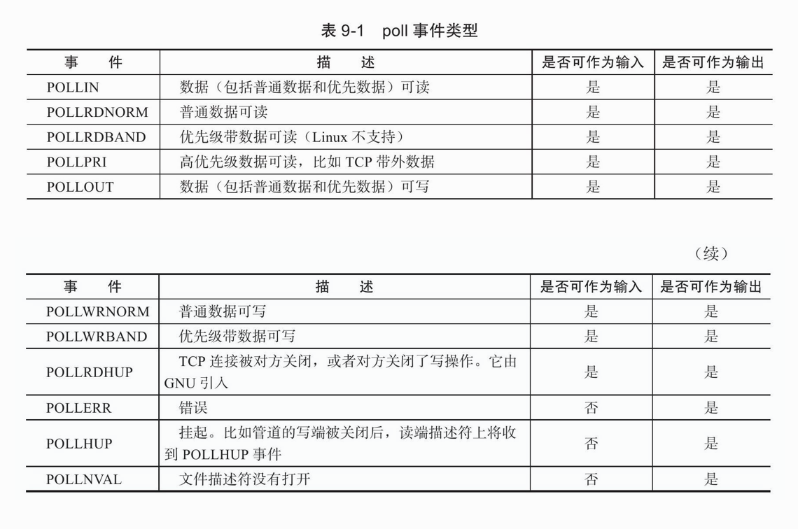

# 《Linux高性能服务器编程》笔记


## 第一章 TCP/IP协议族


* ### TCP/IP协议族主要结构和主要协议
  
  * TCP, IP在后序章节讨论, 本章介绍: ICMP, ARP, DNS协议
  	
  
* 数据链路层: ARP, RARP协议, 实现IP地址与物理地址的转换(通常为mac地址), 以太网, 802.11无线网络, 令牌环都是用mac地址
  
* 网络层: IP协议, ICMP协议, 实现数据包的选路和转发(主机与主机)
  
* 传输层: TCP协议, UDP协议, 
  
* 应用层:ping(应用,不是协议), telnet协议(远程登录协议), DNS(Domain Name Server, 域名服务)
  
  可以在/etc/services查看应用层协议, 以及它们使用了哪些传输层服务(tcp/udp)
  
  - 封装:应用程序发送send->TCP/UDP->IP->ARP
  
  - 分用:IP, ARP, RARP协议都是用帧传输协议,需要帧头部区分它们;同样TCP, UDP, ICMP都是用IP协议
  
  
	
- 测试网络
	
	  
	
	- ARP: `arp`可查询ip与mac的映射
	- DNS: IP与域名的映射, 访问DNS的客户端程序`host github.com`(查询github.com域名的ip地址)


## 第二章 IP协议

### 本章重点: 

1. IP头部信息;

2. IP数据报的路由和转发


- IP服务特点: 无状态; 无连接; 不可靠
  - 无状态: 所有数据报相互独立, 没有先后顺序, 所以无法处理乱序和重复IP数据报
  - 无连接: 上层协议每次发送数据都要指明IP地址, 因为没有连接
  - 不可靠: 只尽最大努力, 但比如数据报存活时间过长或校验不正确, 则返回一个ICMP给上层协议报告错误, 自己不会重传, 需要上层自己实现数据确认, 超时重传等可靠传输机制

- ### IPv4头部

  

  IPv4头部通常都是**20字节**

  第一行: **4位** 版本号: 4(IPv4) + **4位** 长度(单位4字节, 4位最大15, 最长头部60字节) +  **8位** TOS服务类型 + **16位**总长度(单位直接,16位 最大65535字节, 但比如以太网帧MTU最大1500(分片));

  第二行(如何实现分片):**16位** 标识(初始随机生成, 每发一个数据报+1,同一数据报所有分片拥有相同标识) + **3位** 标志(一位保留; 一个“禁止分片”位(超MTU会被丢弃); 一个“更多分片”位, 除最后一个分片其他都要置1) +**13位** 偏移 (单位8字节, 所以分片都是8字节的倍数)

  第三行: **8位** 生存时间TTL(通常64) + **8位** 上层协议(ICMP(1), TCP(6),UDP(17)) + **16位** 检验和(CRC算法,仅头部) 

  第四、五行: IP地址

  可选部分: 如记录路由, 时间戳 等

- ### IP路由

  - IP模块工作流程

    

  - 路由表: 使用`route`命令可查看路由表

    


## 第三章 TCP协议

### 本章重点:

1. TCP头部信息; 

2. TCP状态转移(三次握手, 四次挥手); 

3. TCP数据流(交互数据流, 成块数据流); 

4. TCP流量控制(拥塞控制, 超时重传)




TCP, UDP这种区别对应到编程中体现为通信双方是否执行相同次数的读、写操作


- ### TCP头部信息:

  

前20字节固定(一行4字节 4行)

第一行: **16位** 端口 * 2 

第二行: **32位** 序号 当前TCP segment第一个字节的在整个字节流的偏移量, 就是握手挥手时的seq的值

第三行: **32位** 确认号 收到的上一个对方的segment序号+1 就是ack值

第四行: **4位** 头部长度(单位也是4字节, 和IP头部长度一样, 最长都是60) + **6位** 保留 + **6位** 标志位(URG紧急指针, ACK, PSH立即从接收缓冲区读走, RST重连, SYN建立连接, FIN断开申请) + **16位** 窗口大小(告诉发送方窗口剩余)

第五行: **16位** 校验和(包括头部和数据, 区别于IP校验只有头部) + **16位** 紧急指针


- ### TCP状态转移

  

  半双工(半关闭状态): 单方面不再发送, 但还可以接收(其实就是CLOSE-WAIT状态做的事)

  


- ### TCP的可靠传输实现(差错控制机制)

  - 超时重传: 每次增加一倍(1s, 2s, 4s, 8s, 16s, 连续比如5次之后放弃重传并通知应用)

    - 缺陷:信道利用率低
  - 改进一: 连续ARQ协议(利用滑动窗口实现) ,接收方用“累积确认”的方式, 只对正确接收的最后一个分组确认
    - 累积确认注意不能让发送方等待太长,一般<0.5s
    - 缺陷: 无法通知未确认已接收的具体情况, 导致了“回退N帧”的浪费(漏了一个, 后面的收到了,但要全部重传)
  - 改进二: 选择确认(SACK) (成块传输): 通过指明边界(可选部分最长40字节, 1字节SACK=1, 1字节指明SACK长度, 一个指针4字节, 一对8字节, 所以最多可以指明4个字节块)


- ### TCP的流量控制 (不等同“拥塞控制”)

  - 通过控制窗口大小(rwnd, receive window)
    - 隐患一: B发送rwnd = 0给A, 之后B有空间了发送了非零窗口, 但传输过程丢失了, A一直在等非零, B又等A, 造成死锁
      - 解决: 发送rwnd = 0之后, 接收方启动计时, 到时间发送一个“零窗口”探测报文段
  	- 隐患二: 接收方空间满, 应用一次处理1字节或很少, 每次窗口设为1字节, 传1字节,效率极低
  	  - 解决: 接收方等待一段时间/接收缓存有一半以上空间再更新窗口


- ### TCP拥塞控制(与“流量控制”侧重点不同,拥塞控制关注整个网络)

  - 慢开始: 刚开始注入从小到大慢慢加 (翻倍)

  - 拥塞避免: 线性增加窗口大小, 比“慢开始”慢很多

    

  - 快重传: 收到M2立即确认, 收不到M3, 收到M4,M5都对M2确认, 三次发送方就知道M3丢了

  - 快恢复: 发现拥塞不直接用“慢开始”, 而是将窗口/2, 有的是 门限+3*SMSS


## 第五章 Linux网络编程基础API

### 本章重点

1. socket地址API (IP:port)
2. socket基础API `<sys/socket.h>` 创建/命名/监听socket, 发起连接, 接收连接, 读写数据, 获取地址等
3. 网络信息API `<netdb.h>` 主机名和ip地址的转换, 服务名与端口号的转换


### socket地址API

- 主机字节序 和 网络字节序

  小端字节序/ 主机字节序: 整数高位存储在内存高位;

  大端字节序/网络字节序:反之

  unix专用socket地址结构体`<sys/un.h>`

    ```c++
    主机字节序和网络字节序的转换
    #include<netinet/in.h>
    htonl:host to net short
    htons:host to net long
    ntohs,ntohl同理
    ```

  

  

  ```c++
  #include <sys/un.h>
  struct sockaddr_un{
    sa_family_t sin_family;//地址族
    char sun_path[108];
  };
  
  //另外TCP/IP协议有两个IPv4和IPv6专用结构题, 网络字节序
  struct socketaddr_in{
    sa_family_t sin_family; //AF_INET
    u_int6_t sin_port;//端口号
    struct in_addr sin_addr //IPv4结构体
  };
  
  //其中struct in_addr结构体为
  struct in_addr{
    in_addr_t s_addr;
  }
  
  struct socketaddt_in6{...};
  struct in_addr;//IPv4地址
  struct in6_addr;//IPv6地址
  ```

- IP地址转换函数`<arpa/inet.h>`

  ```c++
  #include <arpa/inet.h>
  int_add_t inet_addr(const char* strptr);//十进制字符串的IPv4地址 -> 网络字节序整数 IPv4地址,失败返回INADDR_NONE;
  //例子:
   servaddr.sin_addr.s_addr = inet_addr("192.168.0.1"); 

	int inet_aton(const char* cp,struct in_addr* inp);//跟上面函数功能一样,但将转换后的结果存储在inp指向的地址结构中
  
  char* inet_ntoa(struct in_addr in);//与第一个函数反过程:网络字节序整数IPv4地址->十进制字符串IPv4地址
  //inet_ntoa means: internet net to address
  //成功1,失败0
  
  int inet_ptoa(int af,const char* src,void* dst);
  //例子:
  inet_ptoa(AF_INET,argv[1],&servaddr.sin_addr);//argv[1]:127.0.0.1 (char*)
  ```


### socket基础API

- socket创建

  ```c++
  #include <sys/socket.h>
  #include <sys/types.h>
  int socket(int domain, int type, int potocol); 
  //domain:指定底层协议族(potocol family)
  //TCP/IP协议而言为PF_INET(IPv4)或PF_INT6(IPv6),UNIX本地域协议而言PF_UNIX
  
  //type:SOCK_STREAM(TCP,流服务), SOCK_DGRAM(UDP,数据报服务)
  //type还可接受上面二个值之一与SOCK_NONBLOCK(非阻塞)和SOCK_CLOEXEC相与的值
  //其中SOCK_CLOEXEC:表示用fork创建子进程时,在子进程中关闭该socket
  
  //potocol:通常设0,表示默认协议,因为上面协议集合下指定一个具体协议,但通常都是唯一的了
  
  //成功返回socket文件描述符(sockfd),失败-1并设置errno
  ```

- socket命名/绑定(socket与socket地址绑定)

  ```c++
	#include <sys/socket.h>
  #include <sys/types.h>
  int bind(int sockfd,struct sockaddr* my_addr,socklen_t addrlen);
  //sockfd:即socket file description,socket文件描述符,会将my_addr所指地址分配给它
  //addrlen指明socket地址长度

  //成功0,失败-1并设置errno
  //常见errno有2种:EACCES和EADDINUSE
  //EACCES:被绑定的地址受保护,仅超级用户可访问(error access)
  //EADDRINUSE:地址正在被使用(error address in use)
 
  ```
  
- socket监听
  
  ```c++
  #include <sys/socket.h>
  int listen(int sockfd,int backlog);
  //sockfd指定被监听的socket
  //backlog指定内核监听队列最大长度,超过返回ECONNREFUSED(error connection refused),现在单指处于ESTABLISHED(完全连接)的数量,典型值5
  ```
  
- socket接受连接 (从监听队列中接受一个连接)
  
  ```c++
  #include <sys/types.h>
  #include <sys/socket.h>
  int accept(int sockfd,struct sockaddr* addr,socklen_t* addrlen);
  //sockfd是调用过listen系统调用过的监听sock
  //addr指明远程socket地址
  //addrlen指明地址长度
  //成功返回一个新socket,服务器可通过读写这个socket与客户端通信,失败返回-1并设置errno
  //accpet只是从监听队列取出一个连接,不关心其状态
  ```
  
- 发起连接
  
  ```c++
  #include <sys/types.h>
  #include <sys/socket.h>
  int connect(int sockfd,struct sockaddr* addr,socklen_t addrlen);
  //成功返回0,sockfd唯一标识这个socket;失败返回-1并设置errno、
  //其中两种常见errno为ECONNREFUSED (端口不存在)和ETIMEDOUT (连接超时)
  ```
  
- 关闭连接
  
  ```c++
  #include <unistd.h>
  int close(int fd);
  //将fd的引用计数-1;一个fork系统调用默认将父进程的引用计数+1
  
  //shutdown是专为网络编程设计的
  #include <sys/socket.h>
  int shutdown(int fd,int howto);
  //howto定义关闭动作
  //SHUT_RD:应用程序不再读缓冲区,缓冲区的数据被直接丢弃
  //SHUT_WT:应用程序不再写入缓冲区,缓冲区中数据会在真正关闭前全部发送出去 (半连接状态)
  //SHUT_RDWT:同时关闭读写
  ```
  
- 数据读写

  ```c++
  ssize_t read(int sockfd,void* buf,size_t len);
  ssize_t write(int sockfd,const void* buf,size_t len);
  ```

  

  - TCP读写

    ```c++
    #include <sys/type.h>
    #include <sys/socket.h>
    ssize_t recv(int sockfd,void* buf,size_t len,int flags);
    //buf和len分别指明缓冲区的地址和大小
    //成功返回读取的数据的长度,可能小于len;返回0表示对方已关闭连接;recv错误返回-1并设置errno
    ssize_t send(int sockfd,const void* buf,size_t len,int flags);
    //成功返回长度,错误同上
    ```

    

  - UDP读写

    ```c++
    #include <sys/types.h>
    #include <sys/socket.h>
    ssize_t recvfrom(int sockfd,void* buf,size_t len,int flags,struct sockaddr* src_addr,socklen_t* addrlen);
    ssize_t sendto(int sockfd,void* buf,size_t,int flags,struct sockaddr* dst_addr,socklen_t addlen);
    //比TCP读写的recv和send多了两个socket地址和长度
    //这两个也是可以用来传输STREAM数据的,只要把最后两个参数赋NULL
    ```

  - 通用读写

    ```c++
    #include <sys/socket.t>
    ssize_t recvmsg(int sockfd,struct msghdr* msg,int flags);
    ssize_t sendmsg(int sockfd,struct msghdr* msg,int flags);
    ```

    

  - 带外数据

    ```c++
    #include <sys/socket.h>
    int socketmark(int sockfd);
    //判断socket下一个数据是否是带外数据
    //如果是,返回1,可用带MSG_OOB的recv调用来接收带外数据
    ```

  - 关闭

    ```c++
    int close(int sockfd);//只将引用-1
    ```

    

- 地址信息函数 (想知道socket本端socket地址和远端socket地址)

  ```c++
  #include <sys/socket.h>
  int getsockname(int sockfd,struct sockaddr* address,socklen_t* address_len);
  int getpeername(int sockfd,struct sockaddr* address,socklen_t* address_len);
  //getsockname获得本端socket地址,放进address
  //getpeername获得远端地址
  //成功返回0,失败-1并设置errno
  ```

  

## 第九章 I/O复用 (同时监听多个fd)

- 本章重点:
  - 客户端要同时处理多个socket (非阻塞connect技术)
  - 客户端要同时处理输入和网络连接 (聊天室程序)
  - TCP服务端要同时处理监听socket和连接socket
  - 服务端要同时处理TCP和UDP请求 (回射服务器)
  - 服务端要同时监听多个端口 (xinetd服务器)
  - select, poll, epoll


可能存在问题:

I/O复用虽能同时监听多个fd, 但本身是阻塞的; 

若多个fd同时就绪, 则只能按顺序处理, 看上去就像串行, 如果要并行, 需要采用多进程多线程


### select系统调用

```c++
#include<sys/select.h>
//select的思想是传入所感兴趣的n个文件描述符上的3个事件集fd_set,并设一个超时时间

int select(int nfds,fd_set* readfds,fd_set* writefds,fd_set* exceptfds,struct timeval* timeout);
//nfds:n file description set 指定fd数量,通常为监听fd中最大值+1
//readfds,writefds,execptdfs分别指向可读,可写,异常对应的fds(文件描述符集合)
//fd_set可以理解为一个按bit位标记句柄的队列,比如要标记一个值为16的句柄, 则fd_set第16位置1
//返回就绪(包括可读,可写,异常fd总数),失败返回-1,设置errno;超时没有修改则返回0

struct timeval{
  long tv_sec;//秒
  long tv_usec;//微秒
};
//timeval超时
//timeval传递0, select会立刻返回
//timeval传递NULL, select会阻塞直到有fd就绪
```

#### 操作fd_set

```c++
#include<sys/select.h>
struct fd_set;//仅包含一个int数组,每一位标记一个fd,
//其中fd_set中fds_bits[__FD_SETSIZE/__NFDBITS],FD_SETSIZE定义为1024

//用以访问/修改fd_set
FD_ZERO(fd_set* fds)//清空fds
FD_SET(int fd,fd_set* fds);//在fds添加一个文件描述符,比如FD_SET(4,read_fds);
FD_ISSET(int fd,fd_set* fds);//检测fd是否在fds中,是否被设置,比如FD_CLR(5,write_fds);
FD_CLR(int fd,fd_set* fds);//fds删除一个文件描述符
```

#### select使用实例

```c++
//...
int connfd = accept(listenfd,(struct sockaddr*)＆client_address,＆client_addrlength);
//...
int ret = 0;
char buf[1024];
//两个事件集
fd_set read_fds;
fd_set exception_fds;
//初始化清空,注意fd_set的操作输入参数都是指针,要&取址
FD_ZERO(＆read_fds);
FD_ZERO(＆exception_fds);
while(1)
{
	memset(buf,'\0',sizeof(buf));
	//每次调用select前都要在read_fds和exception_fds中把感兴趣的文件描述符(这里是connfd)添加进set
  //这里因为只有一个fd需要处理即connfd,但readfd里是有很多个fd的事件的可读事件标志的
  FD_SET(connfd,＆read_fds);
	FD_SET(connfd,＆exception_fds);
  //select会把没有发生的事件从set中删掉,剩下发生的事件
	ret=select(connfd+1,＆read_fds,NULL,＆exception_fds,NULL);
	//处理可读事件
	if(FD_ISSET(connfd,＆read_fds))
	{
		ret=recv(connfd,buf,sizeof(buf)-1,0);//如果是exception_fds则是带外数据,flags位设为"MSG_OOB"
  	printf("get %d bytes of normal data:%s\n",ret,buf);
	}
  //如果要发送,可在前面设置write_fds,在这if(FD_ISSET(connfd,&write_fds)){...}
}
```


### poll系统调用

```c++
#include<poll.h>
//区别于select,poll输入参数除了指定set大小和超时时间timeout,只用一个pollfd数组set来表示,其中包含fd,注册事件,发生事件
int poll(struct pollfd* fds,nfds_t nfds,int timeout);
//返回修改数

//struct pollfd* fds指定我们感兴趣的fd上发生的可读,可写,异常事件
struct pollfd{
  int fd;
  short events;//告诉poll监听fd上哪些事件
  short revents;//由内核修改,通知应用fd正在发生哪些事件
};

define unsigned long int nfds_t;//指定被监听集合的大小

//timeout单位是毫秒,当timeout置-1,poll阻塞直到事件发生;置0立即返回

```



####poll使用实例

```c++
//poll的使用 (比较麻烦,必须遍历所有已注册文件描述符,找到就绪事件)
struct pollfd fds[FD_NUMBER];
//初始化数组中结构体成员
//比如第一个
fds[0].fd = first_fd;
fds[0].events = POLLIN | POLLOUT;//设置多个事件用'|'或运算

int ret = poll(fds,MAX_EVENT_NUMBER,-1);
//遍历
for(int i=0;i<MAX_EVENT_NUMVER;i++){
  //是否可读
  if(fds[i].revents & POLLIN){ 
    int sockfd = fds[i].fd;
    //... 处理sockfd
  }
}
//只看第一个fd
if(fds[0].revents&POLLIN){
  //first_fd...
}
```


### epoll系统调用

epoll与select, poll不同, 它使用一组函数来完成任务, 而不是单个函数; 把用户关心的文件描述符上的事件都放在内核的一个事件表里, 这样就不用每次调用都传入文件描述符集或事件集, 为此epoll需要一个文件描述符来唯一描述这个内核事件表, 这个描述符可通过`epoll_create()`创建

```c++
#include<sys/epoll.h>
int epoll_create(int size);
//size告诉epoll监听多少fd
//返回epoll文件描述符,以供其他epoll调用访问这个事件表
//用完必须close,这个epollfd能在/proc/进程id/fd/看到,不close会耗尽资源
```

```c++
#include<sys/epoll.h>
int epoll_ctl(int epfd,int op,int fd,struct epoll_event* event);
/*
op指定操作选项:
EPOLL_CTL_ADD;
EPOLL_CTL_MOD;
EPOLL_CTL_DEL

fd指定文件,epoll_ctl需要一个fd一个fd添加
成功0;失败-1设置errno
*/

//event的结构
struct epoll_event{
  __uint32_t event;//指定事件
  epoll_data_t data;//指定用户数据,epoll_data_t结构详情在下面
};
//event事件的宏跟poll基本一样, 在poll事件头+'E'即可,比如POLLIN -> EPOLLIN
//但epoll新增两个EPOLLET和EPOLLONESHOT

typedef union epoll_data{
  void* ptr;
  int fd;
  uint32_t u32;
  uint64_t u64;
}epoll_data_t;
//epoll_data_t是一个union(联合体),不能同时使用其中多个成员
```

```c++
#include<sys/epoll.h>
int epoll_wait(int epfd,struct epoll_event* events,int maxevents,int timeout);
//在超时时间内等待一组文件描述符上的事件
//成功返回有绪事件集的文件描述符个数,失败-1,errno
//maxevents监听多少个事件
//events只用于输出就绪事件
```

#### epoll使用实例

```c++
//epoll的使用
int ret = epoll_wait(epollfd,events,MAX_EVENT_NUMBER,-1){
	//可直接处理
  for(int i;i < ret;i++){
    int sockfd = events[i].data.fd;
  }
}
```

```c++
//epoll框架
for( ; ; )
    {
        nfds = epoll_wait(epfd,events,20,500);
        for(i=0;i<nfds;++i)
        {
            if(events[i].data.fd==listenfd) //有新的连接
            {
                connfd = accept(listenfd,(sockaddr *)&clientaddr, &clilen); //accept这个连接
               	//ev用以修改 
              	ev.data.fd=connfd;
                ev.events=EPOLLIN|EPOLLET;
                epoll_ctl(epfd,EPOLL_CTL_ADD,connfd,&ev); //将新的fd添加到epoll的监听队列中
            }
            else if( events[i].events&EPOLLIN ) //接收到数据，读socket
            {
                n = read(sockfd, line, MAXLINE)) < 0    //读
                ev.data.ptr = md;     //md为自定义类型，添加数据
                ev.events=EPOLLOUT|EPOLLET;
              	//修改标识符，等待下一个循环时发送数据，异步处理的精髓
                epoll_ctl(epfd,EPOLL_CTL_MOD,sockfd,&ev);
            }
            else if(events[i].events&EPOLLOUT) //有数据待发送，写socket
            {
                struct myepoll_data* md = (myepoll_data*)events[i].data.ptr;    //取数据
                sockfd = md->fd;
                send( sockfd, md->ptr, strlen((char*)md->ptr), 0 );        //发送数据
                ev.data.fd=sockfd;
                ev.events=EPOLLIN|EPOLLET;
                epoll_ctl(epfd,EPOLL_CTL_MOD,sockfd,&ev); //修改标识符，等待下一个循环时接收数据
            }
            else
            {
                //其他的处理
            }
        }
    }
```


### epoll的LT模式和ET模式

LT: 默认模式, level trigger,电平触发, 相当于高效poll

ET: edge trigger,边沿触发, 相当于高效epoll, 需要往内核事件表注册一个文件描述符的EPOLLET事件, 系统按ET模式操作该文件描述符, 

LT模式下`epoll_wait`检测到事件报告后, 应用可不处理, 下一次有事件,  `epoll_wait`会继续报告直到事件被处理;

ET模式下`epoll_wait`报告事件后必须处理, 减少了重复报告事件

每一个ET模式下的文件描述符都已经是非阻塞的, 否则读写操作没有后续操作一直阻塞(饥渴状态)


### EPOLLONESHOT

一个文件描述符注册了EPOLLONESHOT事件, 只能由一个线程操作, 其他线程无法插手 (操作完成后要重置EPOLLONESHOT 使用`reset_oneshot()`方法, 否则其他线程以后也无法处理)