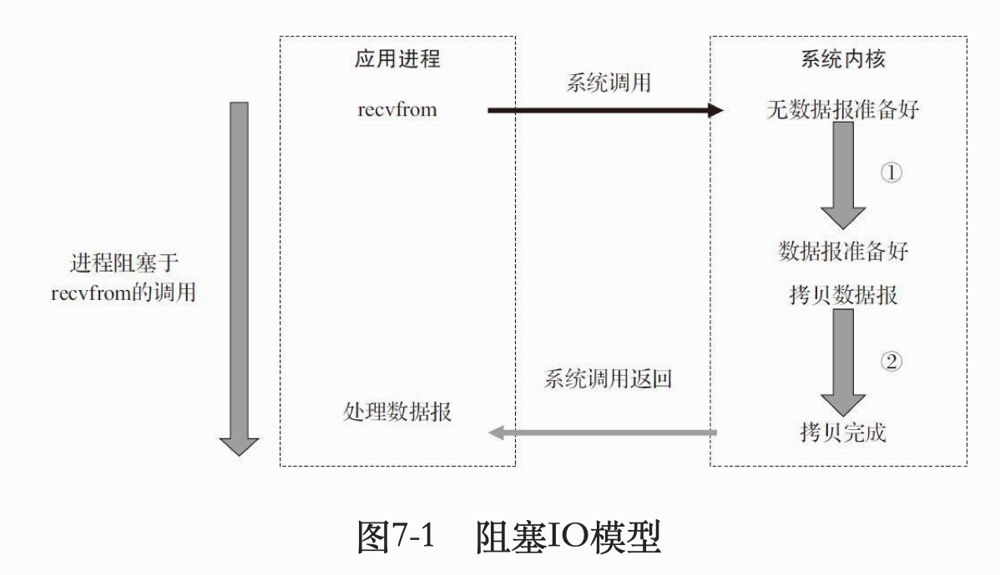
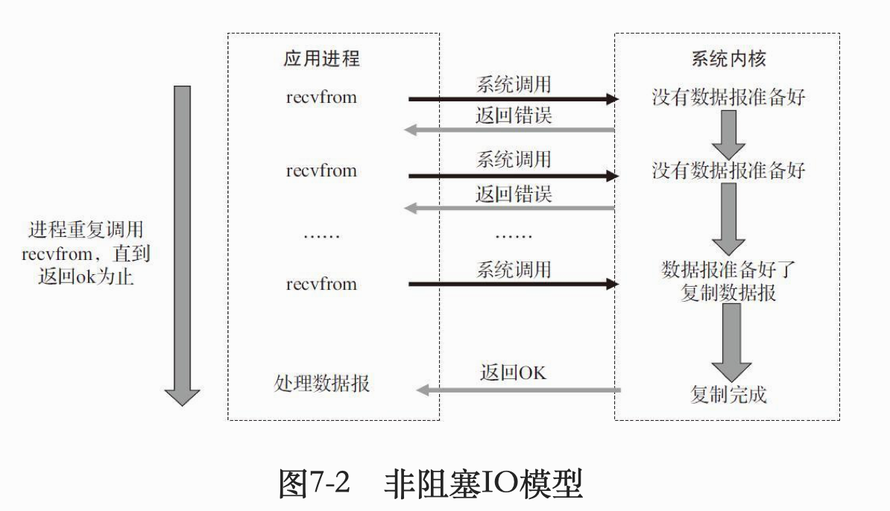
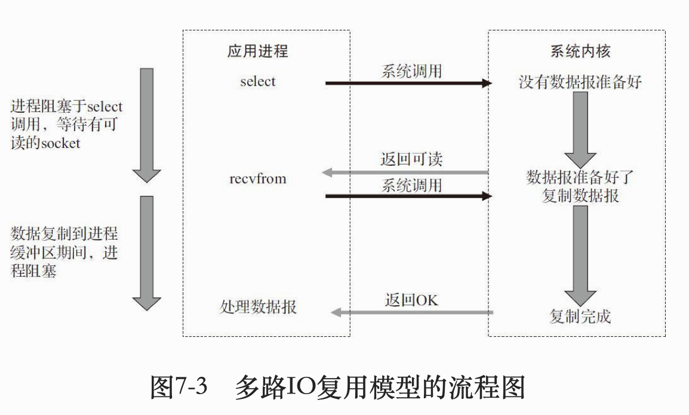

# 《后台开发:核心技术与应用实践》笔记 

该笔记只对该书相较于其他书籍知识点的补充,不包含本书所有内容


## 第三章 常用STL

- vector
	
	```c++
	reserve(1000) //动态增加空间,指定1000
	vecotr<int> (ivec).swap(ivec)//将空间压缩到刚好合适
	vec.erase(it);//it可能需要用find()得到
	```

- map (基于红黑树,自动排序)

  ```c++
  #include<map>
  //建立
  Map<int,string>mapStudent;
  //查找复杂度: log n
  
  //插入
  mapStudent.insert(makepair(1,"student_one"));
  mapStudent.insert(pair<int,string>(2,"student_two"));
  mapStudent[3]="student_3";
  
  iterator->first;//key
  iterator->second;//value
  
  //删除
  map.erase(k);
  
  /*
  自定义排序,默认按key从小到大排序
  map是STL一个模版类,定义:template <class key,class T,class Compare=less<key>,class Allocator = allocator<pair<const key,T>>>;
  Compare是一个比较器,可以自定义
  但如果想:1. 按key从大到小; 2. key是struct; 3. 按value排序
  1.从大到小,利用Compare或自定义Compare
  Map<int,string,greater<int>> mapStudent;
  2.key是struct
  第一个参数换,另外需要重载operator <,因为要排序
  */
  ```

- set(元素值唯一,但一个值可多元素; 自动排序; set, multiset, map, multimap都是基于红黑树)

  ```c++
  #include<set>
  set<int>s1;
  set<int,greater<int>>s2;
  //删除
  s1.erase(vaule);
  s1.erase(&pos);//第pos位
  s1.erase(&first,&last);//注意:左闭右开
  s1.clear();//清除所有
  
  //查找
  count(value);//value的元素个数
  find(vaule)//返回iterator
  ```

  

## 第四章 编译

- 编译与链接

  

  - 预处理: 把#include, #define, #ifdef展开或其他处理

    `g++ -E helloworld.cpp -o helloworld.i` 其中-E表示只进行预处理

  - 编译
  
    `g++ -S helloworld.cpp -o helloworld.s`其中-S表示只进行源码到汇编代码的过程
  
- makefile的撰写

  假设有file1.cpp, file2.cpp, file1.h

  ```c++
  //makefile
  helloworld:file1.o file2.o
    g++ file1.o file2.o -o helloworld
  file1.o:file1.cpp file1.h
    g++ -c file1.cpp -o file1.o
  file2.o:file2.cpp
    g++ -c file2.cpp -o file2.o
  clean:
  	rm file1.o file2.o helloworld
      
  //-o后接目标的名称
  //当可执行文件生成并完成任务之后, 可执行make clean删除file1.o file2.o helloworld
  ```

  

## 第六章 TCP协议

- TCP网络编程

  


## 第七章 网络IO模型

重点: 4种IO模型 (阻塞IO模型; 非阻塞IO模型; 多路IO复用模型; 异步IO模型)


- 网络中有很多等待: 

  - 输入操作(等待数据到达socket接收缓冲区); 
  - 输出操作(等待socket发送缓冲区有足够空间); 
  - 服务端等待连接请求; 
  - 客户端发送连接请求(等待服务端ack)

  

### 阻塞IO模型



数据准备阶段: 比如还没有收到一个完整的TCP包

阻塞区别于非阻塞的IO调用后立即返回给用户一个状态值不会被阻塞

对于阻塞IO模型, 比如recvfrom的时候, 数据准备未完成或者拷贝未完成, 此时用户进程将处于阻塞状态; 或者send()的时候, 也处于阻塞状态无法对其他请求做应答或进行计算

一个改进的方法是使用多线程或多进程 (第九章 和 第十章)

`fork()`: 创建新进程

`pthread_create()`: 创建新线程

执行`listen()`系统会在对应端口监听, 有`connect()`请求会把请求加入到请求队列, 而`accept()`会从请求队列中取出一个返回一个新的fd, 之后的`read()`和`write()`都是通过新fd实现操作的

使用“线程池”或“连接池”可以减少创建和销毁线程的频率, 要调整好“池的大小”, 但始终多线程只能处理小规模的服务请求, 大规模的可以考虑其他方法


### 非阻塞IO模型

需要应用主动不断寻求系统ready了没有



```c++
fcntl(fd,F_SETFL,0_NONBLOCK); //把fd设置为非阻塞
```

非阻塞的`recv()(>0返回数据长;==0表示连接已断开;-1表示error)`会立即返回, 当然允许循环调用, 但不推荐, 因为会极度占用cpu, 如果要检测操作是否完成, 可以用`select( )`多路复用, 一次检测多个连接


### 多路IO复用模型

`select`会不断地轮询所负责的所有socket, 但某个socket有数据到达, 就会通知用户进程



`select`和`recvfrom`都是系统调用, 所以当连接数不是很高的话, `select/epoll`模型并不比多线程阻塞模型性能好, 但大规模连接时能体现出性能

一般采用`select/epoll`模型的socket都设置为非阻塞的, 但是进程依旧会被`select`阻塞, 效果其实类似被socket IO阻塞

```c++
int select(int nfds,fd_set* readfds,fd_set* writefds,fd_set* exceptfds,struct timeval* timeout);
//nfds:n file description set 指定fd数量
//fd_set可以理解为一个按bit位标记句柄的队列,比如要标记一个值为16的句柄, 则fd_set第16位置1

FD_ZERO(int fd,fd_set* fds);
FD_SET(int fd,fd_set* fds);
FD_ISSET(int fd,fd_set* fds);
FD_CLR(int fd,fd_set* fds);
```

