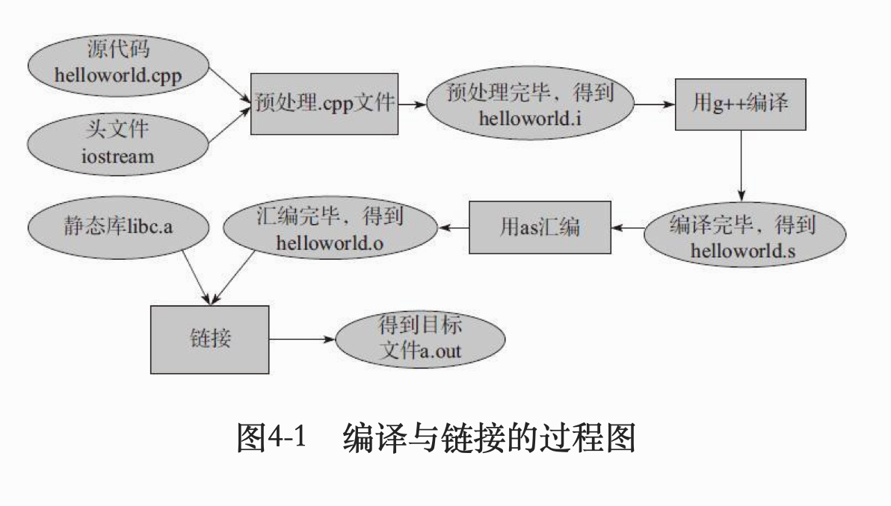
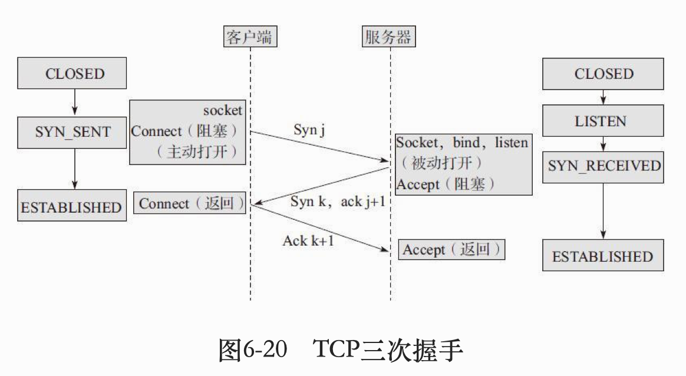

# 《后台开发:核心技术与应用实践》笔记 

该笔记只对该书相较于其他书籍知识点的补充,不包含本书所有内容


## 第三章 常用STL

- vector
	
	```c++
	reserve(1000) //动态增加空间,指定1000
	vecotr<int> (ivec).swap(ivec)//将空间压缩到刚好合适
	vec.erase(it);//it可能需要用find()得到
	```

- map (基于红黑树,自动排序)

  ```c++
  #include<map>
  //建立
  Map<int,string>mapStudent;
  //查找复杂度: log n
  
  //插入
  mapStudent.insert(makepair(1,"student_one"));
  mapStudent.insert(pair<int,string>(2,"student_two"));
  mapStudent[3]="student_3";
  
  iterator->first;//key
  iterator->second;//value
  
  //删除
  map.erase(k);
  
  /*
  自定义排序,默认按key从小到大排序
  map是STL一个模版类,定义:template <class key,class T,class Compare=less<key>,class Allocator = allocator<pair<const key,T>>>;
  Compare是一个比较器,可以自定义
  但如果想:1. 按key从大到小; 2. key是struct; 3. 按value排序
  1.从大到小,利用Compare或自定义Compare
  Map<int,string,greater<int>> mapStudent;
  2.key是struct
  第一个参数换,另外需要重载operator <,因为要排序
  */
  ```

- set(元素值唯一,但一个值可多元素; 自动排序; set, multiset, map, multimap都是基于红黑树)

  ```c++
  #include<set>
  set<int>s1;
  set<int,greater<int>>s2;
  //删除
  s1.erase(vaule);
  s1.erase(&pos);//第pos位
  s1.erase(&first,&last);//注意:左闭右开
  s1.clear();//清除所有
  
  //查找
  count(value);//value的元素个数
  find(vaule)//返回iterator
  ```

  

## 第四章 编译

- 编译与链接

  

  - 预处理: 把#include, #define, #ifdef展开或其他处理

    `g++ -E helloworld.cpp -o helloworld.i` 其中-E表示只进行预处理

  - 编译
  
    `g++ -S helloworld.cpp -o helloworld.s`其中-S表示只进行源码到汇编代码的过程
  
- makefile的撰写

  假设有file1.cpp, file2.cpp, file1.h

  ```c++
  //makefile
  helloworld:file1.o file2.o
    g++ file1.o file2.o -o helloworld
  file1.o:file1.cpp file1.h
    g++ -c file1.cpp -o file1.o
  file2.o:file2.cpp
    g++ -c file2.cpp -o file2.o
  clean:
  	rm file1.o file2.o helloworld
      
  //-o后接目标的名称
  //当可执行文件生成并完成任务之后, 可执行make clean删除file1.o file2.o helloworld
  ```

  

## 第六章 TCP协议

- TCP网络编程

  

